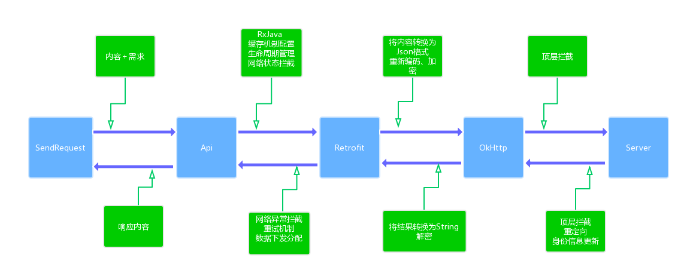

# TBRetrofit 2.0
#### Tips:2.0版本已完成。完整替换为Rxjava＋retrofit模式。
[](https://www.jitpack.io/#HarkBen/TBRetrofit)

#### V 2.0
  * 1.对外保持 通用API 及回调,get,postJson,formData,files
  * 2.缓存插拔式使用－支持永久缓存 并自动初始化首次数据
  * 3.cookie session token 过期自动刷新策略
  * 4.超时自动重试
  * 5.自动于Context绑定，无需担心释放
  * 6.集中处理所望网络异常 并分类下发


### 框架图




## 集成 （由于jitpack 还未支持 build tools 3.0.1 所以还无法使用线上集成）
#### Gradle
> Step1. 在你的**根build.gradle**文件中增加JitPack仓库依赖。

```gradle
         allprojects {
                repositories {
                 jcenter()
                 maven { url "https://jitpack.io" }
                }
            }
```  

> Step2. 在你的module的build.gradle文件中增加TBRetrofit依赖。

```gradle
        dependencies {
        	        compile '－－'
        	}
```   

## 必要权限
```html
    <uses-permission android:name="android.permission.INTERNET"></uses-permission>
    <uses-permission android:name="android.permission.READ_EXTERNAL_STORAGE"></uses-permission>
    <uses-permission android:name="android.permission.WRITE_EXTERNAL_STORAGE"></uses-permission>
    <uses-permission android:name="android.permission.ACCESS_NETWORK_STATE"></uses-permission>
    <uses-permission android:name="android.permission.ACCESS_WIFI_STATE"></uses-permission>
```

## 初始化
```java
OkHttpClient client = new HttpClientFactory.Builder()
                .setDebug(true)
                .autoCache(this)
                .syncCookie(this)
                //session cookie 自动更新
                .addInterceptor(new SignInvalidInterceptor(this,API.loginUrl,PostDataUtils.getSiginParameter()))
                .build();
        RetrofitFactory.Builder.create()
                .setBaseUrl("http://www.aa.com")
                .setOkHttpClient(client)
                .init();

```


## API 调用示例
```java
 HttpUtils.getHttpApi().get(url,listener);
 HttpUtils.getHttpApi().postJson(url,jsonEntity,listener);
```


 **没有专门为2.0版本写server，用的实际项目测试。这里是一个Spring boot 微框架，下载即用。**：[后台测试接口示例](https://github.com/HarkBen/TBRetrofit/tree/master/server);
